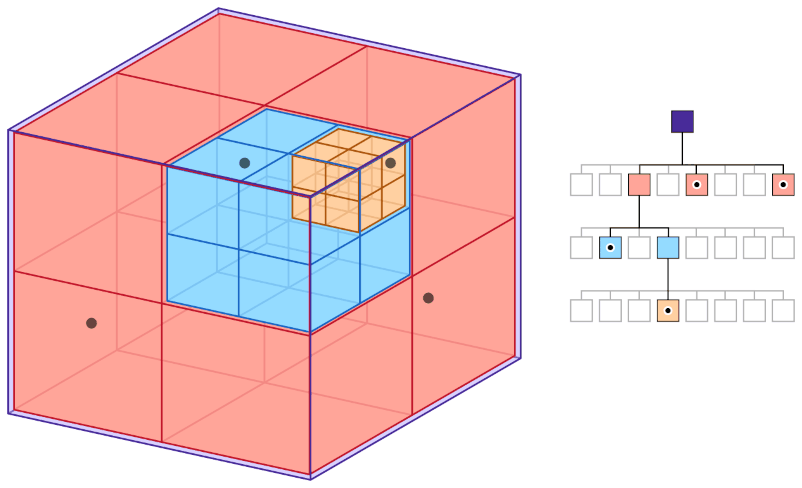

# Project 49: Andromeda

## Barnes Hut Algorithm

## Why Do We Need It?

When simulating a rather large data points in space, such as the many celestial bodies that are found in a singular galaxy. Calculating the force of gravity of that each body exerts on the other, over a specified time interval with a small time step, can lead to a very high computational intense calculations. Hence, the Barnes Hut Algorithm takes some assumptions about the celestial bodies according to their relative positions to each other and their placement on the overall 3D space and decreases the amount of calculations to do. If celestial bodies are sufficiently close to one another, they are approximated as one body with its position being the center of mass of the cluster of bodies. Ofcourse, this does come with some accuracy issues as the algorithm only approximates the values and does not completely calculate them. However, the theoretical dimensional savings go from O(n^2) to O(n log(n)).

## How It Works?

Constructing the Tree:
The Algorithm takes a 3D cubic space with (x, y, z) coordinates and splits it into 8 octants of equal lengths, this corresponds to an octree of a main root with 8 children nodes. As the bodies are inserted into the root of the tree, they are placed into each octant depending on their position, however, no bodies can be within the same octant, in the octree meaning no bodies can exist within the same node. Hence if two or more bodies are close to each other the algorithm will continue to split each octant into another separate octant until the bodies are no longer in the same octant. In terms of the octree, each time a body is inserted into an already filled node, the occupied node will become a parent node with eight accompagning children node and the two or more bodies will be inserted into their respective nodes depending on their position. The algorithm will run this until no two bodies are in the same octant.



<div align="center"> image 1: Octree Layout with 3D Cubic Space </div>

Computing:
Once the tree is constructed and all the bodies are in their respective octants. The algorithm will now determine how to group sufficiently close bodies, this will create temporary bodies with a center of mass that can be used to compute the forces acting on bodies in neighboring octants.

But how does one define sufficiently close enough?
a calculated ratio of s/d will be considered. S is the length of the octant of the internal node, D is the distance between the body and the node's center of mass. This ratio is compared with the threshold value θ, which indicates how fast the algorithm computes but also how inaccurate it may be. a θ = 0, the algorithm receeds to the brute force method as if the algorithm does nothing. If s/d > θ then the body is still sufficiently close enough to the center of mass, and more recursions are needed to divide the octant into its own grid.

## How to Build and Run the code

quite easily you can build it using Cmake:

```
$ mkdir build
cd build
cmake ..
make
```

to run the code:
```
./49
```

## Sprint Progress and Requirements

### Sprint Progress
End of Sprint 2

### Sprint 1 (basics)
In this sprint we will implement the n-body problem and a basic Barnes-Hut approximation. The program will randomly generate initial conditions for testing and the result will be outputted for visualization. We will compare the result of the brute force "reference" solution with the Barnes-Hut algorithm.

### Sprint 1: Definition of "done"

Generate an array of initial masses, positions, and velocities of a system of bodies in 3D space.
Create a brute force n-body simulation O(n*n) (will be later used as a unit test for verification)
Create a function for space-dividing an array of coordinates into an octree data structure.
Implement the Barnes Hut algorithm for simulating the system of bodies over a specified duration of time.
Create a unit test, that compares the brute force reference solution with the Barnes-Hut approximation for a small test dataset
Output a timeseries of the resulting positions of all bodies into a file (e.g. .csv with timestamps) that can be visualized with external tools (e.g. Python script)

### Sprint 2 (OOP)
In this sprint, we will add visualization capabilities to the project, allow the user to configure simulation settings via a config file or command line parameters. The code will be restructured in an Object Oriented way such that the data structure will be based on classes. The functions will be abstracted with interfaces such that they can be switched to any arbitrary interaction function.

### Sprint 2: Definition of "done"

Add the ability to specify parameters like the initial conditions, timestep size, simulation duration etc. in either a configuration file or as command line parameters.
Create a class/datastructure that contains all the parameters (mass, position, velocity) of each body.
Add the ability to visualize the dynamics of the simulation in 3D space.
Abstract the interaction function of the bodies (and add an example of how to use it, e.g. gravity potential and coulomb potential)
Abstract the space dividing function
Clean up and refactor the code

### Sprint 3 (performance and/or STL)
In this sprint, we will analyze and optimize the performance and computation time of the program. The focus will be to study how much impact each section of the code has on the total runtime and the effect of each optimization step taken to reduce computation time.

### Sprint 3: Definition of "done"

Measure how much time is consumed during each section in the code
Utilize at least three different optimization techniques and study its impact on total runtime
At least one function should utilize vectorized instructions

## Expected Output

the C++ project output a position csv (pos.csv) in the build folder that you create, this csv will be used to visualize the animation in the visualization.py

## Authors and acknowledgment
Alexandra Apostolidou, Nicolas Hanna.

Acknowledgment to: 

http://arborjs.org/docs/barnes-hut

https://en.wikipedia.org/wiki/Barnes%E2%80%93Hut_simulation

Image Sources:

https://developer.apple.com/documentation/gameplaykit/gkoctree

## Gitlab reminders

- [ ] [Create](https://docs.gitlab.com/ee/user/project/repository/web_editor.html#create-a-file) or [upload](https://docs.gitlab.com/ee/user/project/repository/web_editor.html#upload-a-file) files
- [ ] [Add files using the command line](https://docs.gitlab.com/ee/gitlab-basics/add-file.html#add-a-file-using-the-command-line) or push an existing Git repository with the following command:

```
cd existing_repo
git remote add origin https://gitlab.lrz.de/advprog2023/49.git
git branch -M main
git push -uf origin main
```
